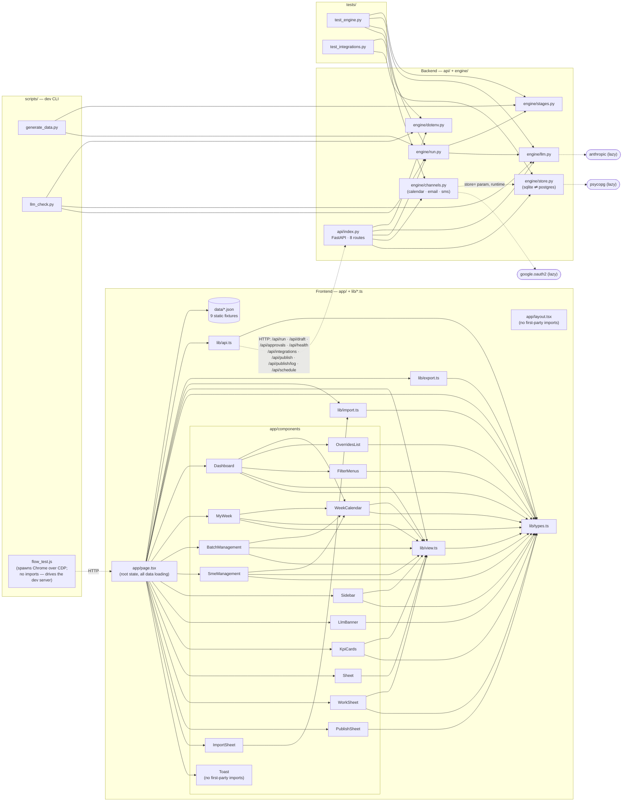

# Code review graph

Module dependency graph, built from the actual `import` statements (not the intended design).
Use it to see what a change reaches before you review it. Regenerate by re-reading imports —
see the note at the bottom.

Edge meaning:
- **solid** = static import.
- **dashed** = runtime call, no import (HTTP across the TS↔Python boundary, or an object
  passed in as a parameter).
- Only first-party edges are drawn. Lazy 3rd-party imports (`anthropic`, `psycopg`,
  `google.oauth2`) are shown as stubs where they gate a feature.



## What the graph flags for review

- **`store.py` + `channels.py` are in the live request path.** `api/index.py` imports both
  (lines 15–17) and four endpoints depend on them: `/api/integrations`, `/api/publish`,
  `/api/publish/log`, `/api/schedule` (GET+POST). They reach the UI through `PublishSheet`.
  Newest and least-exercised surface — review it hardest.
- **`engine/run.py` is the hub.** Four entrypoints route through it (`api/index.py`,
  `generate_data.py`, `llm_check.py`, `test_engine.py`); highest blast radius in the repo.
- **`engine/channels.py` never imports `store`** — it takes one as a `store=` argument
  ([api/index.py:84](../api/index.py#L84)). Nothing static checks that coupling; the two
  move together at runtime only.
- **`lib/types.ts` is the universal sink** and **`lib/view.ts` the shared helper** — a
  signature change in either touches most of the frontend. `Toast` and `layout.tsx` are the
  only files with no first-party imports.
- **`app/page.tsx` owns everything.** It is the sole importer of `lib/api.ts`, `lib/export.ts`
  and `lib/import.ts`, and the only reader of `data/*.json`; components receive callbacks, never
  fetch. Any state bug is a `page.tsx` bug.
- **`lib/import.ts` is pure and has no UI edge.** Text in, rows and issues out — `ImportSheet`
  only renders what it returns, which is why the upload can be checked before anything is created.
- **TS↔Python is HTTP-only** (dashed). The contract across those 8 routes lives in
  `lib/api.ts` payloads vs. `api/index.py` handlers — no compiler checks it, so review both
  halves together.

## Regenerate

No tooling — the graph is small enough to rebuild by hand:

```
rg -n "^\s*(from|import)\s"      engine api scripts tests --glob '*.py'  # backend edges
rg -n "^\s*import .* from ['\"]" lib app --glob '*.ts' --glob '*.tsx'    # frontend edges
rg -n '@app\.(get|post)'         api/index.py                            # route list
```

Drop stdlib lines, keep first-party (`engine.*`, `./`, `@/`) and the lazy 3rd-party stubs.
Grep for lazy imports separately — they sit inside function bodies, not at column 0.
